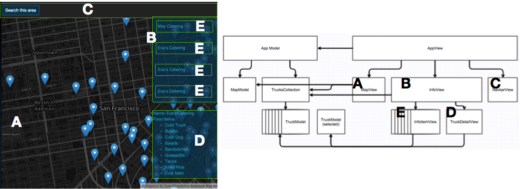

# FoodTruckr web client

## Introduction
This is the web client for the FoodTruckr project. ***IMPORTANT*** This readme describes only the Front end. 
For the general description of the FoodTruckr dummy app and its Back end, see the [Foodtruckr-Server Readme](https://github.com/jjmerino/foodtruckr-server) 


## Front end general architecture

* The application consists of a single page app powered by BackboneJS

* Since application size is small, files have been grouped in models, views and collections folders, instead of by domain entities (e.g: trucks folder).
Folder structure:
```
├── Gruntfile.js
├── README.md
├── app
│   ├── collections
│   │   └── Trucks.js
│   ├── models
│   │   ├── AppModel.js
│   │   ├── MapModel.js
│   │   └── TruckModel.js
│   └── views
│       ├── AppView.js           
│       ├── InfoItemView.js      // E
│       ├── InfoView.js          // B
│       ├── MapView.js           // A
│       ├── NavbarView.js        // C
│       └── TruckDetailView.js   // D
├── bower.json
├── css
│   └── main.css
├── doc
│   └── app.png
├── index.html
└── package.json
```


* For the same reason, inline templates have been used and processed with underscore.js, and all templates are stored in index.html, requiring less http calls.

* The whole app is nested inside a root AppModel and AppView.

* Models and Views are nested forming a tree, starting with the App Model and View as the root. Leafs cannot access their parents as is usual in layered architectures and must rely on firing events.

### Front end considerations

## Map provider

* Mapbox has been used as the map provider for it's ease of customization.

* The map api has been wrapped in the Map View, and not a model, because it requires an html tag to be available on instantiation.

* Leaflet relies on reading the size of it's element on runtime for certain operations. Since the map gets created before the view is inserted in the html, unexpected behaviour occurs when panning the map on the render function.
This was solved by queueing this manipulation in the Event Queue (using `setTimeout(...,0)` ). This ensures the map is already inserted in the HTML, and *does* have a size when Leaflet reads it.

## API

* The app connects to the backend server using jQuery's $.ajax. Note that these calls were not abstracted in their own file because this is the only http in the app which is very small.

## Building the app with grunt

* Grunt has been used to automate the build process by running `grunt build`. This will concat and minify all js and css assets, and put all assets in a self contained dist folder.

### Missing things / next steps
Most things that are missing in the front end are due to the back-end focus of the solution in the limited time available.
* Work has to be done on the UX
* Make a grunt task for rewiring the api urls depending on an environment variable (prod or dev)
* Functional tests
* Search bar for address lookup
* Filtering of food trucks based on food items.
